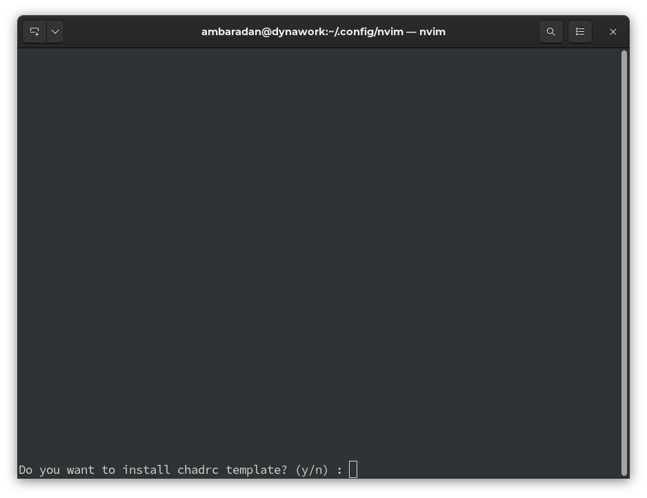
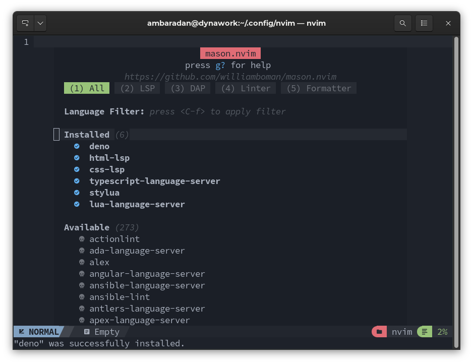
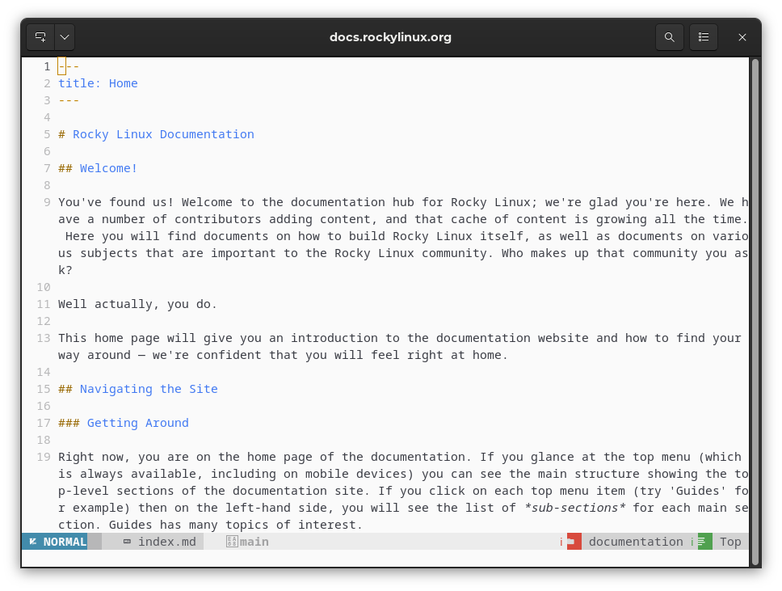

## Turning Neovim into an advanced IDE

This is actually not a real "installation" but rather writing a custom Neovim configuration for our user.

!!! warning "Performing a Clean Installation"

    As specified in the requirements, installing this new configuration on top of a previous one can create unfixable problems. A clean installation is recommended.

### Preliminary Operations

If you have used the Neovim installation before, it will have created three folders in which to write your files, which are:

```text
~/.config/nvim
~/.local/share/nvim
~/.cache/nvim
```

To perform a clean installation of the configuration, we need to back up the previous one first:

```bash
mkdir ~/backup_nvim
cp -r ~/.config/nvim ~/backup_nvim
cp -r ~/.local/share/nvim ~/backup_nvim
cp -r ~/.cache/nvim ~/backup_nvim
```

And then we delete all previous configurations and files:

```bash
rm -rf ~/.config/nvim
rm -rf ~/.local/share/nvim
rm -rf ~/.cache/nvim
```

Now that we have cleaned up, we can move on to installing NvChad.

To do this, simply run the following command from any location within your _home directory_:

```bash
git clone https://github.com/NvChad/NvChad ~/.config/nvim --depth 1 && nvim
```

The command runs a clone of the NvChad configuration hosted on GitHub in the user folder `~/.config/nvim`.

Once the cloning process has been completed the Neovim executable (_nvim_) is called from the second part of the command which will load our new configuration.

On first startup we have the option of creating a `custom` folder with a basic structure from a template (_chadrc_) provided by NvChad from which we can then expand our personal configuration.



Although choosing to install the recommended structure is not mandatory, it is definitely recommended for anyone new to this Editor. Current users of NvChad, who already have a custom `custom` folder, will be able to continue using it after making the necessary changes.

At this point the downloading and configuration of the basic plugins and if we have chosen to also install the template the installation of the configured language server will begin. Once the process is finished we will have our Editor ready to use.

Translated with www.DeepL.com/Translator (free version)

 

As can be seen from the screenshot below, thanks to the configuration changes made, the editor has completely changed in appearance from the basic version of Neovim. It should be remembered, however, that although the configuration of NvChad completely transforms the editor, the base remains Neovim.



### Configuration Structure

Let us now go on to analyze the structure that the configuration created, the structure is as follows:

```text
nvim
├── init.lua
├── lazy-lock.json
├── LICENSE
└── lua
    ├── core
    │   ├── bootstrap.lua
    │   ├── default_config.lua
    │   ├── init.lua
    │   ├── mappings.lua
    │   ├── options.lua
    │   └── utils.lua
    └── plugins
        ├── configs
        │   ├── cmp.lua
        │   ├── lazy_nvim.lua
        │   ├── lspconfig.lua
        │   ├── mason.lua
        │   ├── nvimtree.lua
        │   ├── others.lua
        │   ├── telescope.lua
        │   ├── treesitter.lua
        │   └── whichkey.lua
        └── init.lua
```

The first file we encounter is the `init.lua` file which initializes the configuration by inserting the `lua/core` folder and `lua/core/options.lua`, `lua/core/utils.lua` (and if present, the `lua/custom/init.lua`) files into the _nvim_ tree. Runs the bootstrap of `lazy.nvim` (the plugin manager) and once finished initialize the `plugins` folder.

In particular, the `load_mappings()` function is called for loading keyboard shortcuts. In addition, the `gen_chadrc_template()` function provides the subroutine for creating the `custom` folder. 

```lua
require "core"
require "core.options"
require("core.utils").load_mappings()

local custom_init_path = vim.api.nvim_get_runtime_file("lua/custom/init.lua", false)[1]

if custom_init_path then
  dofile(custom_init_path)
end

-- bootstrap lazy.nvim!
local lazypath = vim.fn.stdpath "data" .. "/lazy/lazy.nvim"

if not vim.loop.fs_stat(lazypath) then
  require("core.bootstrap").gen_chadrc_template()
  require("core.bootstrap").lazy(lazypath)
end

vim.opt.rtp:prepend(lazypath)
require "plugins"

dofile(vim.g.base46_cache .. "defaults")
```

Inclusion of the `core` folder also results in the inclusion of the `core/init.lua` file, which overrides some Neovim interface configurations and prepares for buffer management.

As we can see, each `init.lua` file is included following a well-established order. This is used to selectively override the various options from the basic settings. Broadly speaking, we can say that `init.lua` files have the following functions:

- load global options, autocmds, or anything else.
- override the default options in `core/options.lua`.

This is the call that returns basic command mappings:

```lua
require("core.utils").load_mappings()
```

This sets four main keys from which, in association with other keys, commands can be launched. The main keys are:

- C = <kbd>CTRL</kbd>
- leader = <kbd>SPACE</kbd>
- A = <kbd>ALT</kbd>
- S = <kbd>SHIFT</kbd>

!!! note

    We will refer to these key mappings several times throughout these documents. 

The default mapping is contained in _core/mapping.lua_ but can be extended with other custom commands using its own _mappings.lua_.

Some examples of the standard mapping are:

```text
<space>uu to update NvChad
<space>th to change the theme
<CTRL-n> to open nvimtree
<ALT-i> to open a terminal in a floating tab
```

There are many combinations pre-set for you, and they cover all the uses of NvChad. It is worth pausing to analyze the key mappings before starting to use your NvChad-configured instance of Neovim.

Continuing with the structural analysis, we find the _lua/plugins_ folder, which contains the setup of the built-in plugins and their configurations. The main plugins in the configuration will be described in the next section. As we can see, the _core/plugins_ folder also contains an `init.lua` file, which is used here for the installation and subsequent compilation of the plugins.

